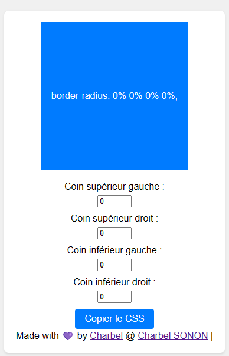

# Border-Radius-Previewer
# Aperçu du Rayon de Bordure

**Border-Radius-Previewer** est une application interactive qui permet aux utilisateurs de prévisualiser et de modifier en temps réel les valeurs de `border-radius` pour créer des effets de coin variés. Ce projet a été conçu pour les débutants afin de les aider à explorer et à comprendre la propriété `border-radius` en CSS.

## Fonctionnalités

- L'utilisateur peut voir une forme à laquelle est appliquée la propriété `border-radius`.
- L'utilisateur peut modifier les valeurs de coin pour personnaliser l'apparence de la forme.
- L'utilisateur peut copier le code CSS résultant dans le presse-papiers.

## Capture d'écran

## Comment exécuter l'application localement

1. Clonez ce dépôt sur votre machine locale.
2. Ouvrez le fichier `border-radius-preview.html` dans votre navigateur web préféré.

## Utilisation

1. Ajustez les valeurs des coins supérieurs gauche, supérieurs droit, inférieurs gauche et inférieurs droit à l'aide des contrôles numériques.
2. La forme se mettra à jour en temps réel pour afficher les modifications.
3. Lorsque vous êtes satisfait de l'apparence, cliquez sur le bouton "Copier le CSS" pour copier le code CSS dans le presse-papiers.

---

Ce projet a été réalisé par [Charbel SONON](https://github.com/AsKing07) dans le cadre de l'apprentissage du développement web. Si vous avez des suggestions d'amélioration ou des questions, n'hésitez pas à ouvrir une issue ou à soumettre une demande de pull.

